# CFn_ForwardProxy
Build forward proxy systems which is composed NLB and autoscalied ec2 instances, by CloudFormation.


# Architecture


# Prerequisites
- Have a VPC with an IGW attached and a public subnet(s).
- A user or role with AdministratorAccess privileges to deploy this CloudFormation template.
- (Option)AWS CLI

# Usage
## (1) (Option)Setup CLI
Make the following settings in the execution environment in order to execute the CLI procedure, when deploying the stack or acquiring AMI information using the AWS CLI.
```shell
export PROFILE="default"       #Specify a profile with AdministratorAccess privileges
export REGION="ap-northeast-1" #Specify Region

#Test
aws --profile ${PROFILE} --region ${REGION} sts get-caller-identity

#It is OK if UserID, Account, Arn are displayed as shown below.
{
    "UserId": "AROAZKIQKBDEIBOE2MGEJ:botocore-session-xxxxxxxxxx",
    "Account": "999999999999",
    "Arn": "arn:aws:sts::999999999999:assumed-role/OrganizationAccountAccessRole/botocore-session-xxxxxxxxxx"
}
```
## (2) Acquisition of setting information
- VPC information
    - VPC ID
    - Public subnet ID(s) where the Foward Proxys are placed.
    - Public or private subnet ID(s) where the NLB is placed.
- Amazon Linux2(arm) AMI ID
    - By GUI:
        - Open the Amazon EC2 console at https://console.aws.amazon.com/ec2/
        - From the console dashboard, choose Launch Instance.
        - Search with the keyword `Amazon Linux 2 AMI (HVM) - Kernel 5.10, SSD Volume Type`
        - Get the ID of the displayed AMI(e.g. `ami-xxxxxxxxxxxxxxxxx`).
    - By CUI:
        ```shell
        AMZ2_AMIID=$(aws --profile ${PROFILE} --region ${REGION} --output text \
            ec2 describe-images \
                --owners amazon \
                --filters 'Name=name,Values=amzn2-ami-kernel-5.10-hvm-2.0.????????.?-x86_64-gp2' \
                          'Name=state,Values=available' \
            --query 'reverse(sort_by(Images, &CreationDate))[:1].ImageId' ) ;
        echo "AMZ2_AMIID = ${AMZ2_AMIID}"
        ```

## (3) Create CloudFormation Stack
- By GUI:
    - [Refer to the User Guide](https://docs.aws.amazon.com/AWSCloudFormation/latest/UserGuide/cfn-console-create-stack.html) for the stack creation procedure.
    - Template: `./src/forward_proxy.yaml`
    - Parameter: Set the information confirmed in `(2)`
- By CUI
    - Set Stack parameters with the information confirmed`(2)`
    ```shell
    # Set values
    VPCID="<VPC ID>"
    PubSubIds="<PubSub1Id>,<PubSub2Id>,<Pubsub3Id>"
    ElbSubIds="<ElbSub1Id>,<Elbsub2Id>,<ElbSub3Id>"
    SrcCidr="<CIDR of VPC>"

    # Set JSON
    CFN_STACK_PARAMETERS='
    [
        {
            "ParameterKey": "VpcId",
            "ParameterValue": "'"${VPCID}"'"
        },
        {
            "ParameterKey": "PublicSubnets",
            "ParameterValue": "'"${PubSubIds}"'"
        },
        {
            "ParameterKey": "ElbSubnets",
            "ParameterValue": "'"${ElbSubIds}"'"
        },
        {
            "ParameterKey": "ProxyAmiId",
            "ParameterValue": "'"${AMZ2_AMIID}"'"
        },
        {
            "ParameterKey": "AllowCidrBlockForProxy",
            "ParameterValue": "'"${SrcCidr}"'"
        }
    ]'
    ```
    - Create Stack
    ```shell
    aws --profile ${PROFILE} --region ${REGION} \
        cloudformation create-stack \
            --stack-name "ForwardProxy" \
            --template-body "file://./src/forward_proxy.yaml" \
    --parameters "${CFN_STACK_PARAMETERS}" \
    --capabilities CAPABILITY_IAM ;
    ```

## (4) Get NLB DNS
Get the DNS of ELB for connecting the forward proxy.
```shell
ProxyDns=$(aws --profile ${PROFILE} --region ${REGION} --output text \
    cloudformation describe-stacks \
        --stack-name "ForwardProxy" \
        --query 'Stacks[].Outputs[?OutputKey==`LoadBalancerDns`].[OutputValue]')
echo "ProxyDns = ${ProxyDns}"
```

## (5) Test
Check if Proxy is available from any client.
The following work is assumed to be performed on Linux.
```shell
# Set the environment variables
ProxyDns="<NLB DNS obtained in (4)>"
export http_proxy="http://${ProxyDns}:3128"
export https_proxy="http://${ProxyDns}:3128"

# Test
# "https://www.google.co.jp" is allowed, "https://www.yahoo.co.jp" is denied.
curl https://www.google.co.jp
curl https://www.yahoo.co.jp
```
